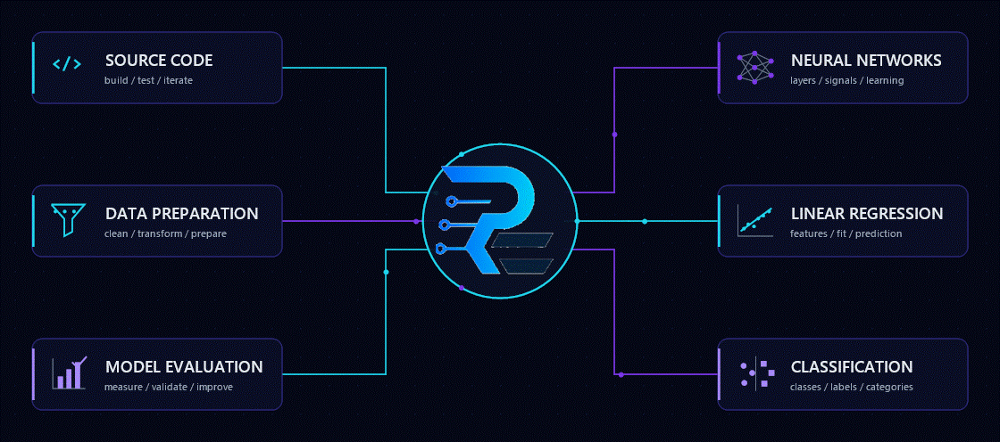
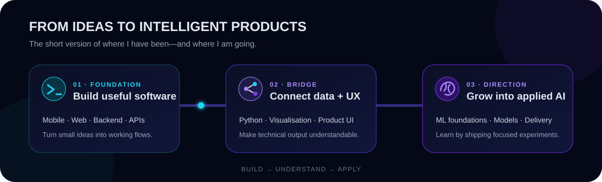

  

  <h1>Hi, I'm Reyy — I turn ideas into useful software.</h1>
  
<strong>Junior Engineer building across product interfaces, backend flows, and the foundations of applied AI.</strong>

  
Software Engineering Student &nbsp;•&nbsp; Yogyakarta, Indonesia &nbsp;•&nbsp; Open to internships and junior opportunities

  
  
  

---

  
<strong>Open the human story behind the visual</strong>

   
  I started by turning small ideas into working mobile, web, backend, and API projects at <strong>SMK Negeri 1 Bantul</strong>. That process taught me that good software is not only about code—it should make a task clearer for the person using it. I am now using Python projects and focused experiments to connect that product mindset with data and AI/ML foundations.

---

## Selected work

Four projects, four different problems. Open a project title or stack to inspect the repository.

<table>
  <tr>
    <td width="50%" valign="top" align="center">
      
      <h3><a href="https://github.com/repan334/FIKSI-SasmitaLens">Sasmita Lens ↗</a></h3>
      
<strong>Fruit-quality scan experience</strong>

      
Turns an AI-oriented idea into an animated mobile flow with reusable UI, Riverpod state, device-sync concepts, and a gamified vendor view.

      
      
    </td>
    <td width="50%" valign="top" align="center">
      
      <h3><a href="https://github.com/repan334/perpustakaan">Library Management ↗</a></h3>
      
<strong>Role-based library workflow</strong>

      
Translates administrator, staff, and borrower needs into a PHP application backed by structured MySQL data.

      
      
    </td>
  </tr>
  <tr>
    <td width="50%" valign="top" align="center">
      
      <h3><a href="https://github.com/repan334/Kalkulator">Calculator ↗</a></h3>
      
<strong>Input-to-result mobile interaction</strong>

      
A focused exercise in interface composition, user input handling, and turning calculation logic into a usable app.

      
      
    </td>
    <td width="50%" valign="top" align="center">
      
      <h3><a href="https://github.com/repan334/Bookshelf-API">Bookshelf API ↗</a></h3>
      
<strong>Book data behind a clean API</strong>

      
An early backend project for understanding resources, request flows, validation, and the responsibilities of a web service.

      
      
    </td>
  </tr>
</table>

  
<strong>More recent experiments</strong>

   
  
  

---

## Proof of motion

Projects show what I build; activity shows that the learning loop is still moving.

  
  

Repository language distribution describes public code composition—not equal proficiency.

---

## Languages & tools, by purpose

Instead of a logo wall, this map explains what each technology helps me make.

### Languages — the instructions behind the product

| Visual | Language | What I use it for |
| :---: | --- | --- |
|  | **Python** | Backend scripts, data exploration, visualisation, and ML foundation exercises. |
|  | **Dart** | Mobile-app logic, state-driven interfaces, and Flutter application structure. |
|  | **PHP** | Server-side web workflows such as role-based library operations. |
|  | **JavaScript** | Interactive web behavior and backend/API fundamentals with Node.js. |
|  | **SQL** | Structuring, storing, querying, and connecting application data. |

### Frameworks — how the product takes shape

<table>
  <tr>
    <td width="33%" align="center" valign="top">
      
      <h4>Mobile &amp; product UI</h4>
      
<strong>Flutter</strong> builds one mobile interface from reusable components. <strong>Figma</strong> helps plan the experience before code.

    </td>
    <td width="33%" align="center" valign="top">
      
      <h4>Web &amp; backend</h4>
      
<strong>Laravel / Node.js</strong> handle server logic and APIs. <strong>React / Next.js</strong> assemble interactive web interfaces.

    </td>
    <td width="33%" align="center" valign="top">
      
      <h4>Data &amp; AI learning</h4>
      
<strong>TensorFlow / PyTorch</strong> support model experiments. <strong>Anaconda</strong> keeps data environments organised.

    </td>
  </tr>
</table>

### Workflow tools — how the work stays testable and shareable

  
    
  <code>Git</code> version history &nbsp;•&nbsp; <code>GitHub</code> collaboration &amp; proof &nbsp;•&nbsp; <code>VS Code</code> development &nbsp;•&nbsp; <code>Postman</code> API checks

 

  
<strong>Open my learning direction</strong>

   
  <table>
    <tr>
      <td><strong>Now reinforcing</strong></td>
      <td>NumPy, Pandas, Matplotlib, Seaborn, preprocessing, scikit-learn, model evaluation, and TensorFlow through small end-to-end projects.</td>
    </tr>
    <tr>
      <td><strong>Next direction</strong></td>
      <td>PyTorch, deep learning, NLP, transformers, LLM APIs, RAG, agents, vector databases, FastAPI, and deployment—step by step.</td>
    </tr>
  </table>
  
<em>This is a direction, not a claim of equal proficiency. Technologies move into my primary stack only after a project gives them evidence.</em>

---

## Contribution trail

  <picture>
    <source media="(prefers-color-scheme: dark)" srcset="https://raw.githubusercontent.com/repan334/repan334/output/github-contribution-grid-snake-dark.svg" />
    <source media="(prefers-color-scheme: light)" srcset="https://raw.githubusercontent.com/repan334/repan334/output/github-contribution-grid-snake.svg" />
    
  </picture>

  

---

  <h2>Have an idea worth building?</h2>
  
I am open to junior roles, internships, and learning-focused collaborations.

  
  
  
    
  

<!-- Design and implementation notes: docs/profile-architecture.md -->
